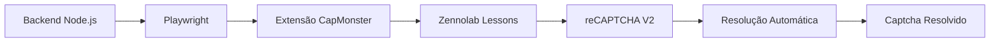

# Integração Híbrida Backend-Extensão CapMonster Cloud

[](https://opensource.org/licenses/MIT)
[](https://capmonster.cloud/)
[](https://nodejs.org/)

Uma solução inovadora que combina a potência do backend com a simplicidade da extensão CapMonster Cloud para automatizar a resolução de captchas no site de testes Zennolab Lessons.

## 🚀 Problema Resolvido

Ao utilizar a API de integração direta do CapMonster Cloud, desenvolvedores frequentemente enfrentam:

- Complexidade na configuração e gerenciamento de tokens
- Dificuldade na sincronização entre backend e contexto do navegador
- Processos manuais propensos a erros
- Aumento significativo no tempo de desenvolvimento

## 💡 Solução Proposta

Este projeto elimina a complexidade da integração tradicional criando uma ponte inteligente entre seu backend e a **Extensão do CapMonster Cloud para Navegadores**. A solução automatiza todo o processo de resolução de captchas em segundo plano, especificamente testada no site [Zennolab Lessons](https://lessons.zennolab.com/).

## 🛠️ Como Funciona


📋 Pré-requisitos
Node.js 18+ instalado

- Conta no CapMonster Cloud

- Chave API da CapMonster Cloud

- Extensão CapMonster Cloud para navegador

## ⚡ Instalação Rápida
1. Clone e Instale as Dependências
```bash
# Navegue até a pasta do projeto
cd CapMonster-Cloud-Integration-Challenge

# Instale o Playwright
npm init playwright

# Instale as dependências do projeto
npm install

```

## 2. Execução do Projeto
```bash
# Navegue para a pasta service
cd service

# Execute o projeto
npm start
```

Configuração do Playwright
O projeto utiliza Playwright configurado com a extensão CapMonster:

```javascript
const {chromium} = require("@playwright/test");
 
//const rp = require("request-promise");
const pathToExtension = require('path').join(__dirname, '../extensao/capmonster');
const keycaptcha = "digite aqui  key";

  let  browser = " " 
async function run (){

 
try {
  
  browser = await chromium.launchPersistentContext('', {
    headless: false,
    viewport: {"width": 1193, "height": 1013},
    args: [
      `--disable-extensions-except=${pathToExtension}`,
      `--load-extension=${pathToExtension}`
    ]
  });

```

## 🔧 Uso do Projeto
Testando no Zennolab Lessons
O projeto está configurado para testar automaticamente no site Zennolab Lessons com foco no modelo reCAPTCHA V2.

Para testar outros modelos:

- Acesse https://lessons.zennolab.com/

- Escolha o modelo de captcha desejado

- Copie a URL do desafio

- Modifique o arquivo de configuração

 
## 📊 Modelos de Captcha Suportados
O projeto foi testado com os seguintes modelos no Zennolab Lessons:

- ✅ reCAPTCHA V2 (Testado e funcionando)

- 🔄 reCAPTCHA V3

 

Para testar outros modelos, substitua a URL no código:

```javascript
//  
    await page.goto("https://lessons.zennolab.com/captchas/recaptcha/invisible.php?level=high", {timeout: 0});
```

## 🙋‍♂️ Suporte
Documentação CapMonster: https://capmonster.cloud/documentacao

Zennolab Lessons: https://lessons.zennolab.com/

Issues: GitHub Issues

Desenvolvido com ❤️ para o Desafio de Integração do CapMonster Cloud


